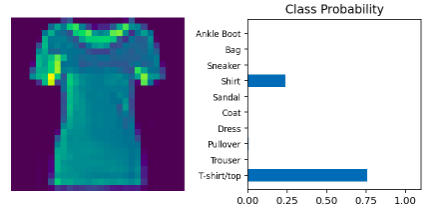
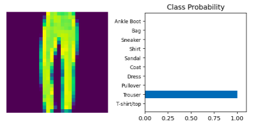

# MNIST_Fashion-classifier

A simple classifier using pytorch in deep-learning. 
Example-1: 

 
Example-2: 
 
Accuracy about 85%.  
The second file is the same except it uses tenserflow 2.2.0 as the framework. 
Accuracy about 88%
